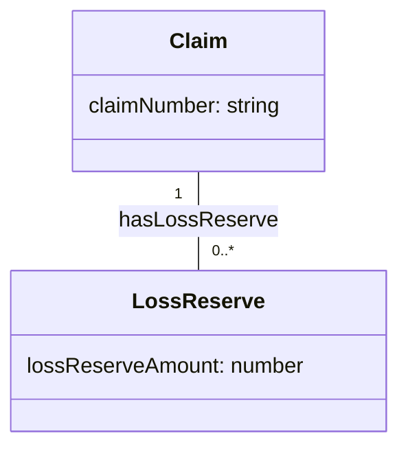

Let's break down the sentence and map each element, attribute, and relationship to the ontology defined in your Turtle (.ttl) archive:

### Sentence Breakdown

**1. Claim number 12312701 has a total claim amount of 3100, spread across 2 loss reserves.**
- _Element_: Claim
- _Attribute_: claimNumber = 12312701
- _Attribute_: total claim amount = 3100 (Note: ontology does not have a direct "total claim amount" property, but this could be calculated from related payments or reserves)
- _Relationship_: hasLossReserve (links Claim to LossReserve)
- _Attribute of Relationship_: 2 LossReserve instances

**2. Claim number 12312702 has 0 loss reserves, and consequently has a total claim amount of 0.**
- _Element_: Claim
- _Attribute_: claimNumber = 12312702
- _Attribute_: total claim amount = 0
- _Relationship_: hasLossReserve (0 LossReserve instances)

---

### Ontology Mapping

#### **Classes & Instances**

- **Claim**: `in:Claim`
  - Attribute: `in:claimNumber`
- **LossReserve**: `in:LossReserve`
  - Attribute: `in:lossReserveAmount`
- **Relationship**: `in:hasLossReserve` (Claim → LossReserve)

#### **Triples for Each Claim**

##### For Claim 12312701

```turtle
# Instance of Claim
:Claim_12312701 rdf:type in:Claim ;
  in:claimNumber "12312701" ;
  # Relationship to LossReserve instances
  in:hasLossReserve :LossReserve_1 , :LossReserve_2 .

# LossReserve instances
:LossReserve_1 rdf:type in:LossReserve ;
  in:lossReserveAmount "1550" . # Example value, sum must be 3100

:LossReserve_2 rdf:type in:LossReserve ;
  in:lossReserveAmount "1550" . # Example value, sum must be 3100
```

##### For Claim 12312702

```turtle
# Instance of Claim
:Claim_12312702 rdf:type in:Claim ;
  in:claimNumber "12312702" .

# No LossReserve relationships
# (No triples for in:hasLossReserve, total claim amount = 0)
```

---

### **Attribute Mapping**

- **Claim number** → `in:claimNumber` (Data property of Claim)
- **Total claim amount** → _Not explicitly in ontology_, but can be inferred by summing `in:lossReserveAmount` from related LossReserve instances via `in:hasLossReserve`
- **Loss reserves** → Count of `in:hasLossReserve` relationships from Claim to LossReserve

---

### **Relationship Mapping**

- **Claim "has loss reserve"** → `in:hasLossReserve` (Object property from Claim to LossReserve)

---

## **Summary Table**

| Sentence Element           | Ontology Class/Property        | Notes/Mapping                              |
|---------------------------|-------------------------------|--------------------------------------------|
| Claim number              | `in:claimNumber` (Claim)      | Data property of Claim                     |
| Total claim amount        | *Sum of* `in:lossReserveAmount` | Not directly modeled, can be inferred      |
| Number of loss reserves   | `in:hasLossReserve` (Claim → LossReserve) | Count relationships                        |
| LossReserve amount        | `in:lossReserveAmount` (LossReserve) | Data property of LossReserve               |

---

### **Visualization of Ontology Mapping**



---

## **TL;DR Mapping**

- **Claim**: `in:Claim` instance
  - `in:claimNumber`
  - `in:hasLossReserve` → 0 or more `in:LossReserve`
    - `in:lossReserveAmount` for each LossReserve

- **Total claim amount**: _Not a direct property_; sum of all `in:lossReserveAmount` for LossReserves linked via `in:hasLossReserve`.

---

If you need specific RDF Turtle triples for these sentences, let me know!